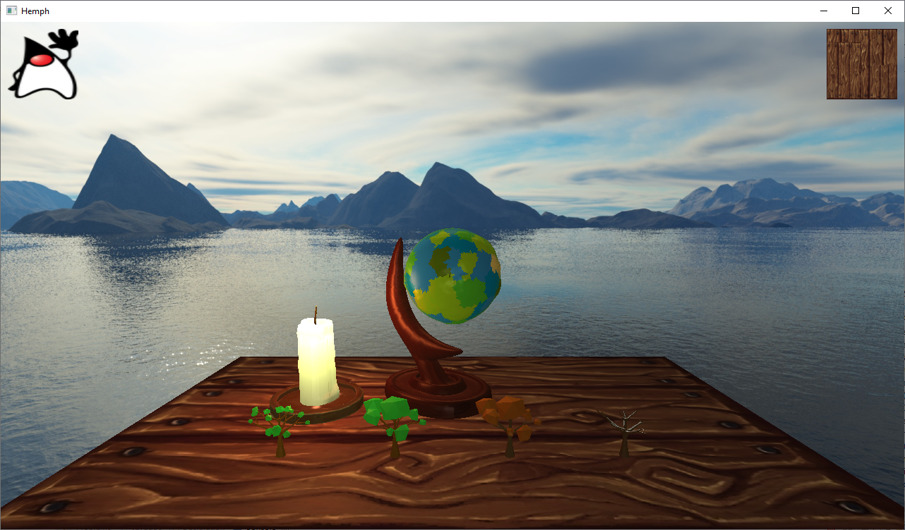
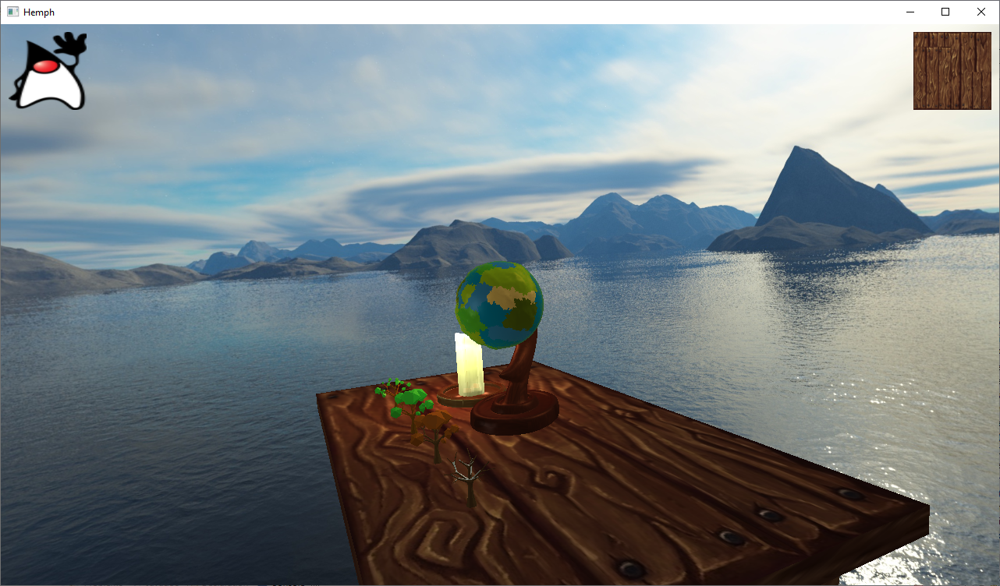
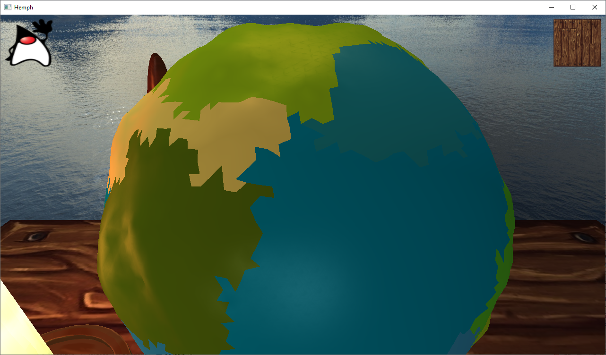
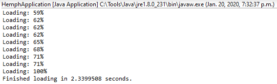

# Hemph

Personal side project :)
Hopefully this will one day become a great game.

Acknowledgements to Jay Ren for making 3D models.

So far I've got nice rendering (including a skybox).

Clickable buttons + quaternion slerping

Procedural globe generation (albeit low detail).

And smooth resource loading. Eventually I will add a loading bar instead of printing to console.

